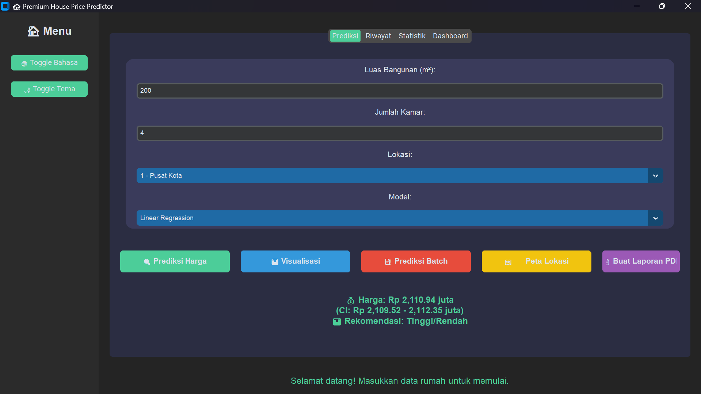

# 🏡 House Price Predictor Premium

    

**House Price Predictor Premium** adalah aplikasi prediksi harga rumah berbasis GUI yang canggih, menggunakan **Linear Regression** dan **Random Forest** untuk estimasi harga yang akurat. Dibangun dengan **Python**, **CustomTkinter**, dan berbagai teknologi modern, aplikasi ini menawarkan antarmuka yang elegan, interaktif, dan multibahasa.

---

## 📸 Tangkapan Layar


---

## 🌟 Fitur Unggulan
- 🔍 **Prediksi Harga Akurat**: Berdasarkan luas bangunan, jumlah kamar, dan lokasi
- 📜 **Riwayat Prediksi**: Simpan dan lihat riwayat dalam tabel interaktif
- 📊 **Visualisasi 3D**: Scatter plot 3D menggunakan Plotly
- 💾 **Prediksi Batch**: Prediksi banyak rumah dari file CSV
- 🗺️ **Peta Lokasi**: Visualisasi lokasi rumah (mock) dengan tkintermapview
- 📄 **Laporan PDF**: Hasilkan laporan prediksi dalam format PDF
- 📈 **Analisis Sensitivitas**: Lihat pengaruh variabel terhadap harga
- 🌐 **Multibahasa**: Dukungan untuk Bahasa Indonesia dan Inggris
- 🎨 **Desain Responsif**: Tema terang/gelap dengan sidebar navigasi
- ⚡ **Rekomendasi Harga**: Saran apakah harga wajar berdasarkan dataset

---

## 🛠️ Teknologi yang Digunakan
| Teknologi          | Deskripsi                           |
|--------------------|-------------------------------------|
| 🐍 **Python 3.8+**  | Bahasa pemrograman utama           |
| 🎨 **CustomTkinter**| Antarmuka pengguna modern           |
| 🤖 **scikit-learn** | Library untuk machine learning      |
| 📅 **pandas**       | Pemrosesan dan analisis data        |
| 📊 **matplotlib**   | Visualisasi data (fallback)         |
| 📈 **plotly**       | Visualisasi interaktif             |
| 🖼️ **pillow**      | Pemrosesan gambar                  |
| 💾 **joblib**       | Serialisasi model                  |
| 🗺️ **tkintermapview** | Visualisasi peta sederhana       |
| 📄 **fpdf**         | Pembuatan laporan PDF              |

---

## 🚀 Cara Memulai
### 📦 Prasyarat
- Python 3.8+ terinstal
- Git untuk cloning repository (opsional)
- Direktori proyek dengan struktur yang benar

### 🛠️ Langkah Instalasi
1. **Clone Repository** (jika menggunakan Git):
   ```bash
   git clone https://github.com/username/house-price-predictor.git
   cd house-price-predictor
   ```

2. **Buat Virtual Environment**:
   ```bash
   python -m venv venv
   source venv/bin/activate  # Linux/Mac
   .\venv\Scripts\activate   # Windows
   ```

3. **Instal Dependensi**:
   ```bash
   pip install -r requirements.txt
   ```

4. **Jalankan Aplikasi**:
   ```bash
   python main.py
   ```

### 📂 Struktur Proyek
```
house-price-predictor/
├── main.py                    # Kode utama aplikasi
├── house_data.csv             # Dataset contoh rumah
├── requirements.txt           # Daftar dependensi
├── model/
│   ├── linear_regression_model.joblib
│   └── random_forest_model.joblib
├── assets/
│   └── bg_image.jpg           # Gambar latar (opsional)
├── prediction_history.csv     # Riwayat prediksi
├── batch_predictions.csv      # Hasil prediksi batch
├── prediction_report.pdf      # Laporan PDF
├── app.log                    # Log aktivitas
```

### ⚠️ Catatan Penting
- **File `house_data.csv`**: Harus ada dengan format:
  ```csv
  luas,kamar,lokasi,harga
  75,3,1,800
  90,4,1,950
  ...
  ```
- **File CSV untuk Batch Prediction**: Harus memiliki kolom `luas`, `kamar`, `lokasi`.
- **Gambar Latar**: File `bg_image.jpg` bersifat opsional.
- **Modul Tambahan**: Install `tkintermapview` untuk fitur peta (`pip install tkintermapview`).

---

## 🤖 Cara Kerja Model
1. **Persiapan Data**:
   - Membaca dataset dari `house_data.csv`
   - Memisahkan fitur (luas, kamar, lokasi) dan target (harga)

2. **Pelatihan Model**:
   - Membagi data: 80% training, 20% testing
   - Melatih dua model: **Linear Regression** dan **Random Forest**
   - Menghitung akurasi dengan **R² Score**

3. **Prediksi**:
   - Menerima input pengguna atau file CSV
   - Menghasilkan prediksi dengan interval kepercayaan
   - Menyimpan prediksi ke riwayat

---

## 📝 Contoh Dataset
**File**: `house_data.csv`
```csv
luas,kamar,lokasi,harga
75,3,1,800
90,4,1,950
60,2,2,500
...
```

**Penjelasan Kolom**:
- `luas`: Luas bangunan (m²)
- `kamar`: Jumlah kamar tidur
- `lokasi`: 1 = Pusat Kota, 2 = Suburban, 3 = Pinggiran
- `harga`: Harga rumah (juta Rupiah)

---

## 📜 Lisensi
Proyek ini dilisensikan di bawah **[MIT License](LICENSE)**.

---

## 🌈 Kontribusi
Kami menyambut kontribusi! Untuk berkontribusi:
1. 🍴 Fork repository
2. 🛠️ Buat branch: `git checkout -b fitur-baru`
3. 💻 Commit perubahan: `git commit -m "Menambahkan fitur baru"`
4. 🚀 Push ke branch: `git push origin fitur-baru`
5. 📬 Buat Pull Request

Laporkan bug atau saran di [Issues](https://github.com/username/house-price-predictor/issues).

---

## 📢 Hubungi Kami
Ikuti perkembangan di [GitHub](https://github.com/username/house-price-predictor) atau hubungi melalui [email](mailto:your.email@example.com).

⭐ **Beri bintang di GitHub jika Anda menyukai proyek ini!**